# 📧 Outreach Architect Pro
### *Autonomous Precision-Targeted Sales Intelligence Engine*

[](https://github.com/Ismail-2001)
[](https://github.com/Ismail-2001)
[](https://github.com/Ismail-2001)
[](LICENSE)

---

## 🎬 Project Overview
**Outreach Architect Pro** transforms cold outreach from a generic numbers game into a **high-precision targeting system**. Developed for modern sales teams, it leverages **Kimi 2.5** and real-time data enrichment to achieve a **15-20% response rate**, obliterating the industry standard of 1%. This is an autonomous platform that researches, strategizes, and drafts hyper-personalized engagement sequences.

---

## 🏗️ The Multi-Stage Agentic Workflow
The system operates on a sophisticated **Research-Strategize-Audit** loop, ensuring every email feels like it was written by a personal assistant.

```mermaid
graph TD
    Input[📥 Raw Lead Data] --> Ingestion[1. Smart Ingestion]
    Ingestion --> Enrichment[2. Real-time Enrichment]
    Enrichment --> Analysis[3. Strategic Analysis Agent]
    
    subgraph "The Strategy Core"
    Analysis --> Strategy[Output: Structured Strategy Doc]
    Strategy --> Drafting[4. Content Persona Agent]
    end
    
    Drafting --> Audit{5. Quality Control Auditor}
    
    Audit -- Score < 80 --> Revision[Back to Drafting]
    Revision --> Drafting
    
    Audit -- Score >= 80 --> Approved[6. Delivery Queue]
    Approved --> Final[🎯 High-Impact Outreach]

    style Analysis fill:#1a1a2e,stroke:#00ff00,color:#fff
    style Drafting fill:#1a1a2e,stroke:#00bfff,color:#fff
    style Audit fill:#1a1a2e,stroke:#ff9900,color:#fff
```



---

## ✨ Key Features
- **Smart Data Enrichment:** Automatically fills missing company data, recent news, and pain points from live sources.
- **Autonomous Strategy Agent:** Generates a unique engagement strategy for every lead based on "Cognitive Hooks."
- **Kimi 2.5 Integration:** High-context reasoning and hyper-personalized content generation.
- **Auditor Feedback Loop:** An internal "Quality Control" agent that scores drafts and demands revisions for low-quality content.
- **Lead Dashboard:** Real-time tracking of outreach status from "Ingestion" to "Converted."

---

## 🛠️ Tech Stack
| Tier | Technology |
| :--- | :--- |
| **Frontend** | React, Vite, Framer Motion (Premium UI) |
| **Backend** | Node.js, Express, MongoDB/Supabase |
| **AI Orchestration** | Kimi 2.5 LLM, Custom Agentic Loops |
| **Data Flow** | Puppeteer (Scraping), Real-time Enrichment APIs |

---

## 🏁 Installation & Setup
### Prerequisites
- Node.js v18+
- Kimi API Credentials

### Backend Setup
```bash
cd backend
npm install
cp .env.example .env  # Add your keys
npm start
```

### Frontend Setup
```bash
cd frontend
npm install
npm run dev
```

---

## 🚀 Usage
1. **Import Leads:** Upload a CSV or paste lead LinkedIn URLs.
2. **Run Enrichment:** The agent will autonomously gather context.
3. **Generate Strategy:** Watch as the system creates a "Cognitive Hook" for each lead.
4. **Approve Drafts:** Review the high-scoring email drafts in the dashboard.

---

## 🗺️ Roadmap
- [ ] Multi-channel support (LinkedIn DMs / Twitter)
- [ ] A/B Testing Engine for Agent Personas
- [ ] Integration with HubSpot & Salesforce
- [ ] Voice synthesis for autonomous cold-calling bots

---

### 🔗 Connecting the Intelligence
Developed by **[Ismail Sajid](https://ismail-sajid-agentic-portfolio.netlify.app/)**.
*Explore more Autonomous Agents on my [Main Profile](https://github.com/Ismail-2001).*

⭐ **Star this repo if you find it useful!**
